# Game Engine Flow Diagrams — Based on Unit Tests

Sơ đồ flow được vẽ từ 2 file unit test:
- [movement-and-economy.test.ts](file:///d:/AI_Project/Monopoly/packages/game-engine/tests/movement-and-economy.test.ts)
- [jail-and-bankruptcy.test.ts](file:///d:/AI_Project/Monopoly/packages/game-engine/tests/jail-and-bankruptcy.test.ts)

---

## 1. Tổng quan: Game Engine Turn Cycle

Sơ đồ chính thể hiện vòng lặp 1 lượt chơi (turn) của game engine, bao gồm tất cả các nhánh logic được cover bởi unit test.

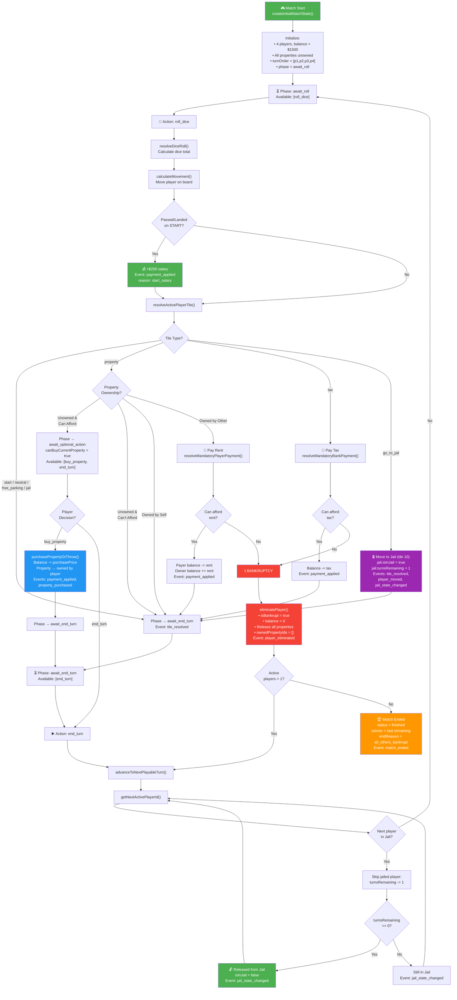

---

## 2. Turn Phase State Machine

Sơ đồ state machine thể hiện các trạng thái (phase) của một turn, tương ứng với `EngineTurnState.phase`.

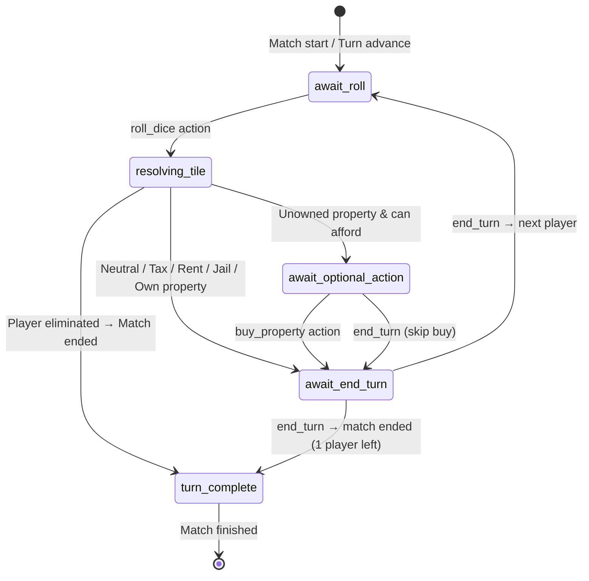

---

## 3. Chi tiết từng Test Case → Flow

### Test File 1: [movement-and-economy.test.ts](file:///d:/AI_Project/Monopoly/packages/game-engine/tests/movement-and-economy.test.ts)

````carousel
### Test 1: Initial State
Kiểm tra trạng thái khởi tạo match.

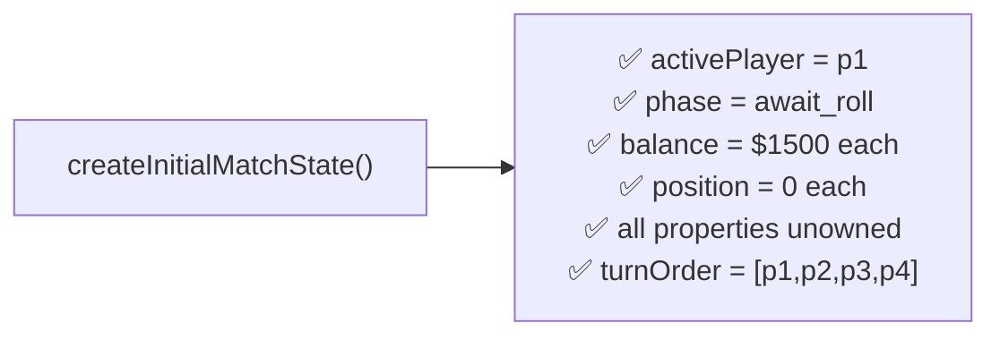
<!-- slide -->
### Test 2: Roll Dice — Wrap Start + Buy Option
Player ở vị trí 39, roll [1,1] → vị trí 1 (qua GO).

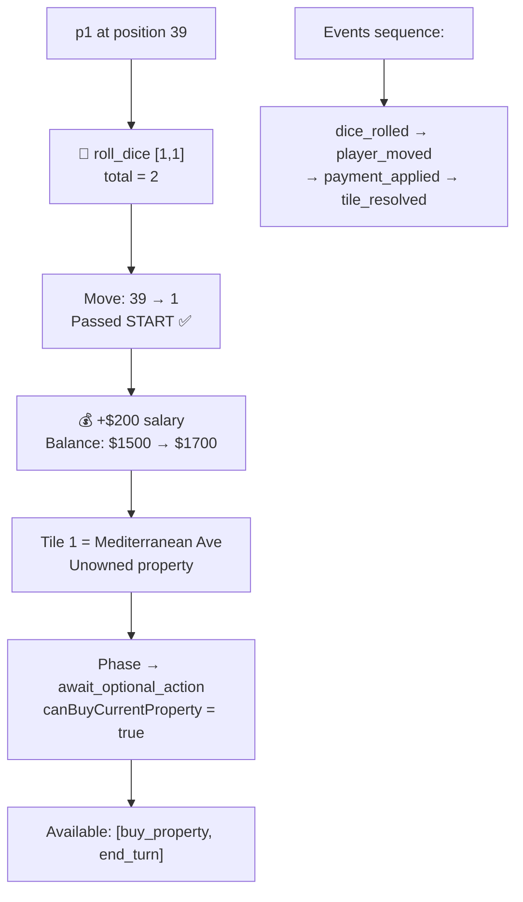
<!-- slide -->
### Test 3: Buy Property
Player roll đến ô property chưa owned → chọn buy.

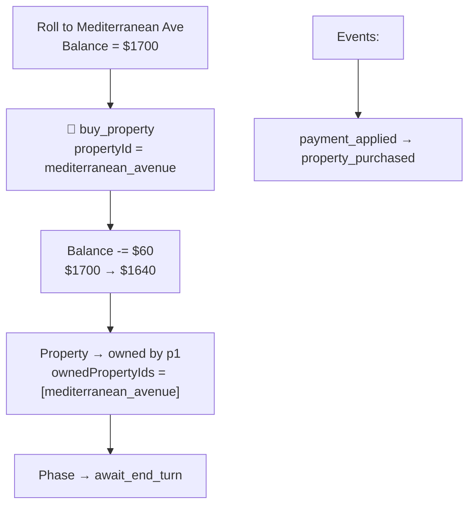
<!-- slide -->
### Test 4: Pay Rent
Player đến ô sở hữu bởi người khác → tự động trả rent.

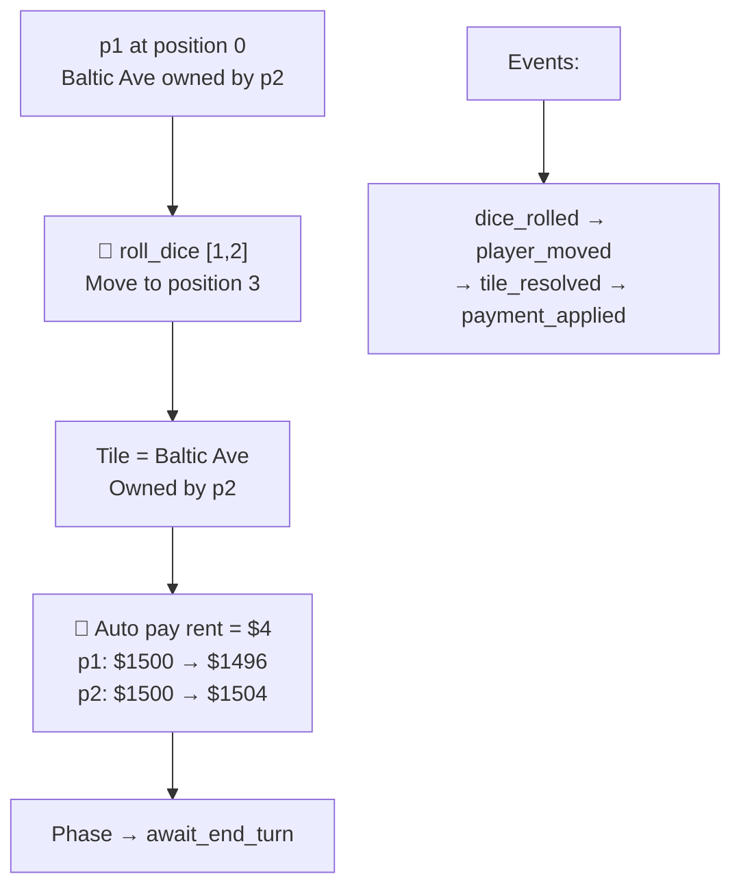
<!-- slide -->
### Test 5: Tax Tile
Player đến ô thuế → tự động trừ tiền.

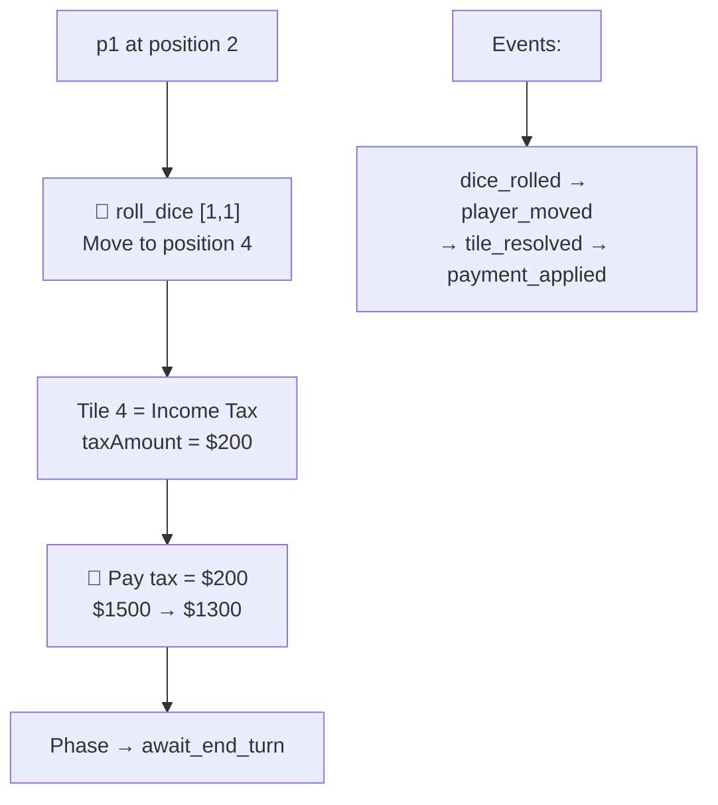
<!-- slide -->
### Test 6: Go To Jail
Player đến ô "Go to Jail" → bị dịch chuyển vào Jail.

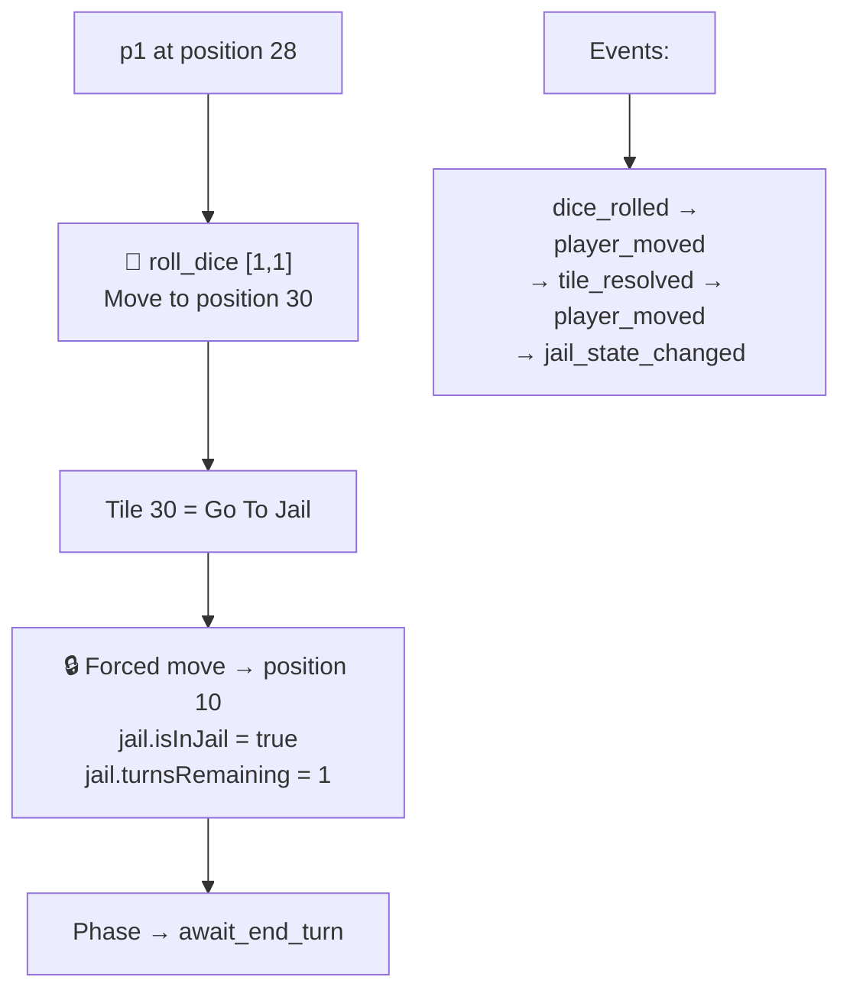
````

### Test File 2: [jail-and-bankruptcy.test.ts](file:///d:/AI_Project/Monopoly/packages/game-engine/tests/jail-and-bankruptcy.test.ts)

````carousel
### Test 7: Bankruptcy by Tax
Player không đủ tiền trả thuế → bị loại.

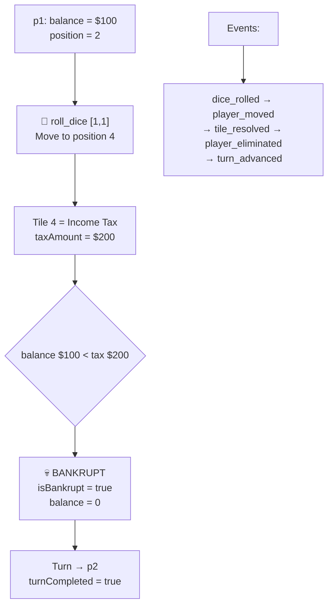
<!-- slide -->
### Test 8: Bankruptcy by Rent — Release Properties
Player không đủ trả rent → bị loại, properties trả về bank.

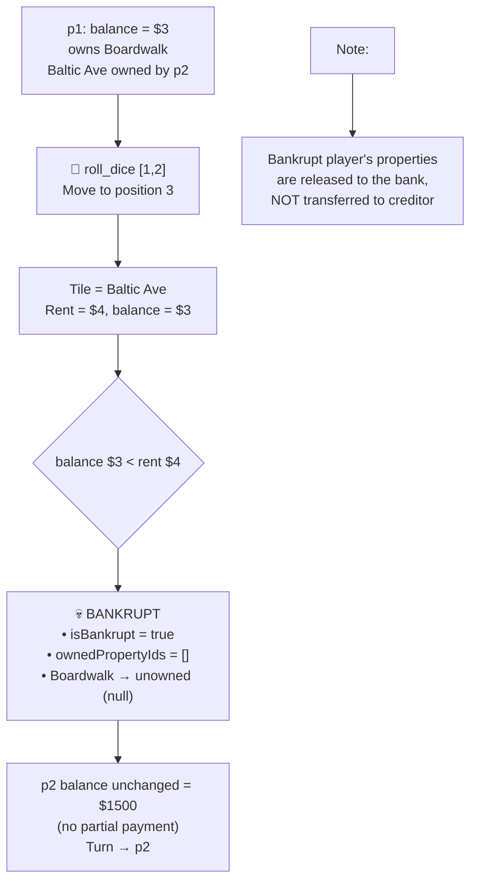
<!-- slide -->
### Test 9: Match Ends — Last Player Standing
Khi chỉ còn 1 player active, match kết thúc.

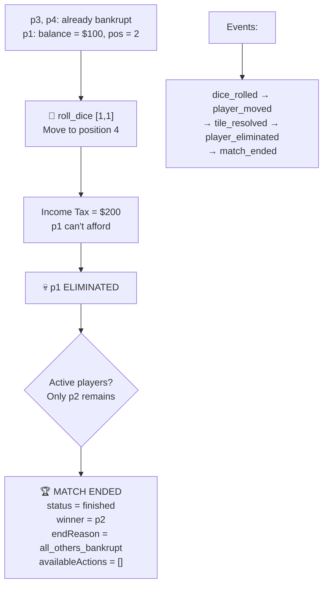
<!-- slide -->
### Test 10: Jail Skip & Auto-Release
Player trong jail bị skip 1 turn, sau đó tự động release.

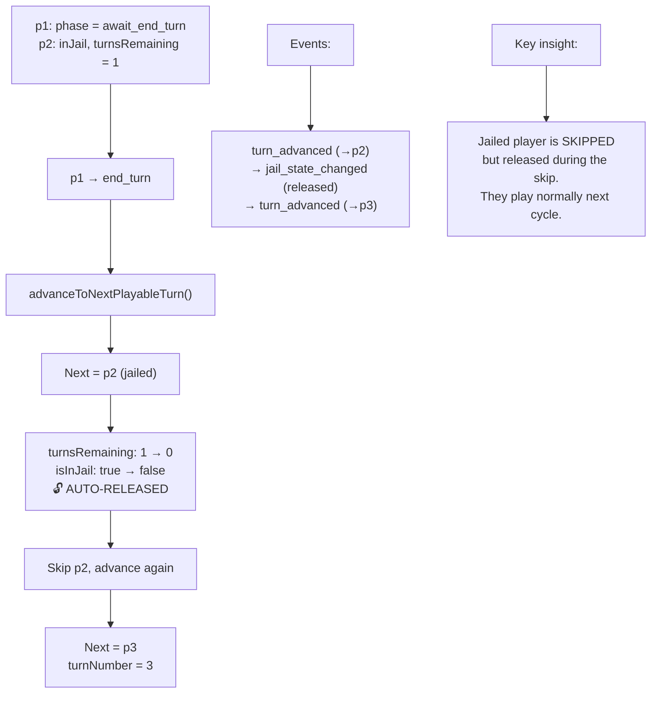
````

---

## 4. Event Flow Summary

Bảng tóm tắt chuỗi event cho mỗi scenario được test:

| # | Scenario | Events Sequence |
|---|----------|----------------|
| 1 | Roll → Unowned Property (pass GO) | `dice_rolled` → `player_moved` → `payment_applied` (salary) → `tile_resolved` |
| 2 | Buy Property | `payment_applied` (purchase) → `property_purchased` |
| 3 | Land on Owned Property (rent) | `dice_rolled` → `player_moved` → `tile_resolved` → `payment_applied` (rent) |
| 4 | Land on Tax Tile | `dice_rolled` → `player_moved` → `tile_resolved` → `payment_applied` (tax) |
| 5 | Land on Go To Jail | `dice_rolled` → `player_moved` → `tile_resolved` → `player_moved` → `jail_state_changed` |
| 6 | Bankruptcy by Tax | `dice_rolled` → `player_moved` → `tile_resolved` → `player_eliminated` → `turn_advanced` |
| 7 | Bankruptcy by Rent (release props) | `dice_rolled` → `player_moved` → `tile_resolved` → `player_eliminated` → `turn_advanced` |
| 8 | Match End (last player) | `dice_rolled` → `player_moved` → `tile_resolved` → `player_eliminated` → `match_ended` |
| 9 | Jail Skip & Release | `turn_advanced` → `jail_state_changed` → `turn_advanced` |

---

## 5. Available Actions by Phase

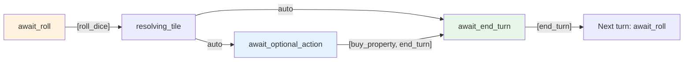

| Phase | Available Actions |
|-------|------------------|
| `await_roll` | `roll_dice` |
| `await_optional_action` | `buy_property`, `end_turn` |
| `await_end_turn` | `end_turn` |
| `turn_complete` | `end_turn` |
| `resolving_tile` | _(none — auto-resolved)_ |
| Match `finished` | _(none)_ |
