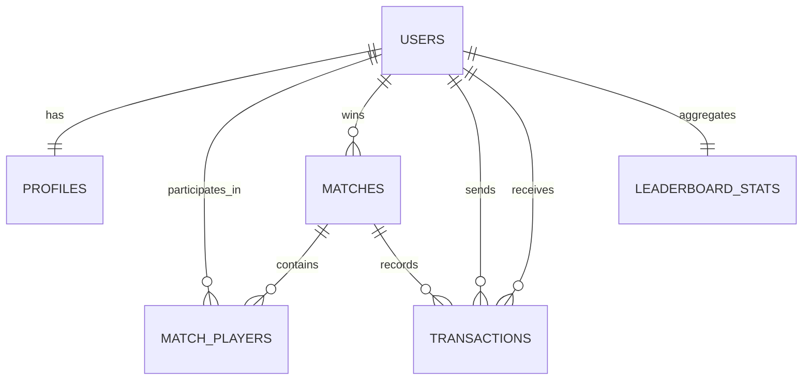

# Phase 4 - Step 2: Relational Schema Design

## Objective

Design the initial PostgreSQL relational schema for the MVP persistence layer.

This step turns the persistence boundary from Step 1 into a concrete table and relationship design that later Prisma models and migrations can implement directly.

## Design Principles

The relational schema for the MVP should follow these rules:

- store durable business data, not live Colyseus room sync state
- keep the schema MVP-first and easy to evolve
- preserve historical match data even if player profile data changes later
- keep board configuration code-driven in shared config, not database-driven
- support match history, leaderboard, and result persistence before advanced analytics

## ID and Data Type Strategy

### Primary Keys

Recommended strategy:

- use `UUID` primary keys for durable entities
- use generated UUIDs in PostgreSQL/Prisma for all main tables

Tables that should use UUID primary keys:

- `users`
- `matches`
- `match_players`
- `transactions`

### Money Values

Use:

- `INTEGER`

Reason:

Monopoly money in the MVP is whole-number currency with no decimal precision requirement.

### Timestamps

Use:

- `TIMESTAMPTZ`

Reason:

This keeps the persistence layer safe for cross-time-zone logging and later production deployment.

### Enums vs Text

Recommended approach:

- use PostgreSQL enums or Prisma enums for stable bounded states
- use `TEXT` only where controlled flexibility is more useful than strict enumeration

Good enum candidates:

- `user_auth_type`
- `match_status`
- `match_end_reason`
- `elimination_reason`
- `transaction_type`

## Initial MVP Table Set

The recommended initial relational schema is:

- `users`
- `profiles`
- `matches`
- `match_players`
- `transactions`
- `leaderboard_stats`

Not included in the initial migration baseline:

- `rooms`
- `lobby_metadata`
- custom board tables
- replay/event-sourcing tables
- live room snapshot tables

## Table Design

### `users`

Purpose:

- durable player identity for both current and future auth flows

Recommended columns:

- `id UUID PRIMARY KEY`
- `auth_type` enum
- `email TEXT NULL`
- `password_hash TEXT NULL`
- `created_at TIMESTAMPTZ NOT NULL`
- `updated_at TIMESTAMPTZ NOT NULL`
- `last_seen_at TIMESTAMPTZ NULL`

Recommended constraints:

- unique index on `email` when present

Notes:

- `auth_type` can begin with values such as `guest` and `local`
- OAuth-specific fields can be added later without destabilizing the MVP schema

### `profiles`

Purpose:

- player-facing profile data separated from account identity

Recommended columns:

- `user_id UUID PRIMARY KEY REFERENCES users(id)`
- `display_name TEXT NOT NULL`
- `avatar_key TEXT NULL`
- `created_at TIMESTAMPTZ NOT NULL`
- `updated_at TIMESTAMPTZ NOT NULL`

Notes:

- this is a `1:1` extension of `users`
- match history should still snapshot display names in match records so historical views remain stable after profile edits

### `matches`

Purpose:

- durable record of each played match

Recommended columns:

- `id UUID PRIMARY KEY`
- `source_lobby_id TEXT NULL`
- `board_config_key TEXT NOT NULL`
- `status` enum
- `started_at TIMESTAMPTZ NOT NULL`
- `finished_at TIMESTAMPTZ NULL`
- `end_reason` enum NULL
- `winner_user_id UUID NULL REFERENCES users(id)`
- `player_count INTEGER NOT NULL`
- `created_at TIMESTAMPTZ NOT NULL`
- `updated_at TIMESTAMPTZ NOT NULL`

Recommended constraints:

- `player_count` should remain within the MVP bounds of `4` to `6`

Notes:

- `board_config_key` should reference the code-driven board identifier such as `classic-40`
- `source_lobby_id` remains a lightweight text reference because lobbies are not yet persisted as first-class relational records
- keeping a `status` column allows started-vs-finished visibility without reconstructing everything from timestamps alone

### `match_players`

Purpose:

- durable player participation and end-state summary per match

Recommended columns:

- `id UUID PRIMARY KEY`
- `match_id UUID NOT NULL REFERENCES matches(id)`
- `user_id UUID NOT NULL REFERENCES users(id)`
- `display_name_snapshot TEXT NOT NULL`
- `turn_order INTEGER NOT NULL`
- `start_balance INTEGER NOT NULL`
- `final_balance INTEGER NULL`
- `final_position INTEGER NULL`
- `final_rank INTEGER NULL`
- `is_bankrupt BOOLEAN NOT NULL`
- `is_abandoned BOOLEAN NOT NULL`
- `elimination_reason` enum NULL
- `eliminated_at TIMESTAMPTZ NULL`
- `created_at TIMESTAMPTZ NOT NULL`
- `updated_at TIMESTAMPTZ NOT NULL`

Recommended constraints:

- unique constraint on `(match_id, user_id)`
- unique constraint on `(match_id, turn_order)`

Notes:

- `display_name_snapshot` preserves what players saw during that match even if the profile changes later
- `final_position` is optional but useful for summaries and debugging
- `final_rank` may be derived later, but storing it makes leaderboard/history queries simpler

### `transactions`

Purpose:

- durable summary of important monetary events during a match

Recommended columns:

- `id UUID PRIMARY KEY`
- `match_id UUID NOT NULL REFERENCES matches(id)`
- `sequence_no INTEGER NOT NULL`
- `turn_number INTEGER NULL`
- `transaction_type` enum NOT NULL
- `from_user_id UUID NULL REFERENCES users(id)`
- `to_user_id UUID NULL REFERENCES users(id)`
- `property_key TEXT NULL`
- `tile_index INTEGER NULL`
- `amount INTEGER NOT NULL`
- `metadata_json JSONB NULL`
- `created_at TIMESTAMPTZ NOT NULL`

Recommended constraints:

- unique constraint on `(match_id, sequence_no)`
- `amount > 0`

Notes:

- `property_key` should use the board/shared-config property identifier, not a DB foreign key to a property table
- `metadata_json` is optional and should stay lightweight, for example to capture summary context rather than full event sourcing
- this table is for durable summary history, not for syncing live room state every time money changes

### `leaderboard_stats`

Purpose:

- cached aggregate stats for fast player ranking and summary queries

Recommended columns:

- `user_id UUID PRIMARY KEY REFERENCES users(id)`
- `matches_played INTEGER NOT NULL`
- `wins INTEGER NOT NULL`
- `losses INTEGER NOT NULL`
- `bankruptcies INTEGER NOT NULL`
- `abandons INTEGER NOT NULL`
- `last_match_at TIMESTAMPTZ NULL`
- `updated_at TIMESTAMPTZ NOT NULL`

Notes:

- this table should be treated as a durable aggregate cache
- values can be updated when a match finishes rather than recalculated on every leaderboard request

## Relationship Summary

## Recommended Indexes

### `users`

- unique index on `email`
- index on `created_at`

### `profiles`

- index on `display_name` if profile search becomes necessary

### `matches`

- index on `started_at DESC`
- index on `finished_at DESC`
- index on `winner_user_id`
- index on `status`

### `match_players`

- unique index on `(match_id, user_id)`
- unique index on `(match_id, turn_order)`
- index on `user_id`
- index on `(match_id, final_rank)`

### `transactions`

- unique index on `(match_id, sequence_no)`
- index on `(match_id, created_at)`
- index on `from_user_id`
- index on `to_user_id`

### `leaderboard_stats`

- index on `wins DESC`
- index on `matches_played DESC`
- index on `last_match_at DESC`

## Recommended Enum Set

Suggested initial enum families:

### `user_auth_type`

- `guest`
- `local`

### `match_status`

- `playing`
- `finished`

### `match_end_reason`

- `last_player_remaining`
- `all_others_bankrupt`
- `all_others_abandoned`
- `manual_termination_dev_only`

### `elimination_reason`

- `bankrupt`
- `abandoned`

### `transaction_type`

- `property_purchase`
- `rent`
- `tax`
- `start_salary`
- `bankruptcy_summary`

## What Is Intentionally Not Modeled As Tables Yet

The following items should remain out of the relational schema for now:

- board tiles as relational rows
- property ownership as a live-updated relational table
- per-turn snapshots
- per-action room state sync tables
- live reconnect/session tables
- card deck and draw history tables

Reason:

These either belong to shared config or to live runtime state, not to the MVP persistence baseline.

## Query Patterns This Schema Supports

This initial schema is designed to support:

- player profile retrieval
- match history pages
- per-player participation history
- leaderboard queries
- basic transaction summaries per match
- winner and result lookup

## Step 2 Decisions

The following relational design decisions are now locked for the Phase 4 baseline:

- board configuration remains code-driven and referenced by `board_config_key`
- `users` and `profiles` stay separate
- match history is centered on `matches` + `match_players`
- transaction persistence is summary-focused, not full event sourcing
- live room state is not normalized into relational tables
- no persistent `rooms` table is required for the initial migration baseline

## Exit Criteria

Step 2 is complete when:

- the initial MVP table set is defined
- key relationships and constraints are explicit
- enum candidates are identified
- the design is ready to be translated into Prisma models in Step 3 and Step 4